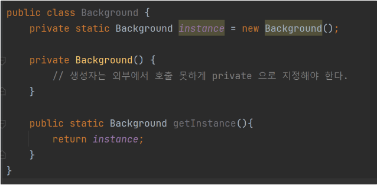

## Sigleton 이란 무엇인가?

**프로그램 안에서 특정 클래스의 객체가 딱 하나만 있도록 강요하는 디자인 패턴**

프로그램 전체에서 사용되는 클래스를 생성하는 방법

1. 싱글턴
2. 정적 클래스

언제 사용되는가?

- 로그 기록,  캐싱, 사용자 설정 → 프로그램에서 전역적으로 사용하고 유일하게 존재할 때 사용

## Sigleton 을 사용하는 이유

<aside>
🔥 클래스에 인스턴스가 하나만 있도록 한다
</aside>

일부 공유 리소스(예: 데이터베이스 또는 파일)에 대한 접근을 제어하기 위함이다

예를 들어 객체를 생성했지만 잠시 후 새 객체를 생성하기로 했다고 가정해 보자. 그러면 새 객체를 생성하는 대신 이미 만든 객체를 받게 된다

물론 생성자 호출은 특성상 **반드시** 새 객체를 반환해야 하므로 위 행동은 일반 생성자로 구현할 수 없습니다.

이는 다시 말해서 **메모리 측면** 에서 이점이 있다. 최초 한 번의 new 연산자를 통해서 고정된 메모리 영역(**JVM 메모리 구조에서 메서드 영역**)을 사용하기 때문에 추후 해당 객체에 접근할 때 메모리 낭비를 방지 할 수 있다. 뿐만 아니라 이미 생성된 인스턴스를 활용하니 속도 측면에서도 이점이 있다고 볼 수 있다

<aside>
🔥 해당 인스턴스에 대한 전역 접근 지점을 제공합니다
</aside>

전역 변수와 마찬가지로 싱글턴 패턴을 사용하면 프로그램의 모든 곳에서부터 일부 객체에 접근할 수 있다. 그러나 이 패턴은 다른 코드가 해당 인스턴스를 덮어쓰지 못하도록 보호하기도 한다

이는 다시 말해서 **데이터 공유가 쉽다**는 것이다. 싱글톤 인스턴스가 전역으로 사용되는 인스턴스이기 때문에 다른 클래스의 인스턴스들이 접근하여 사용할 수 있다. 하지만 여러 클래스의 인스턴스에서 싱글톤 인스턴스의 데이터에 동시에 접근하게 되면 동시성 문제가 발생할 수 있으니 이점을 유의해서 설계하는 것이 좋다

## Sigleton 을 어떻게 만드는가?

### 공통점

1. 싱글톤을 구현하고자 하는 클래스 내부에 멤버 변수로써 **private static 객체 변수**를 만듭니다.
2. 다른 객체로 부터 Sigleton class 에 대해 new 연산을 막기 위해 **기본 생성자를 private** 로 한다
3. 생성자처럼 행동하는 **static 생성 메서드**를 만든다.

### Early Initialization

**싱글톤 객체를 미리 생성해 놓는 방식**으로 항상 싱글톤 객체가 필요하거나 객체 생성 비용이 크게 들어가지 않는 경우에 사용

- **장점**

  static 으로 생성된 변수에 싱글톤 객체가 선언되었기 때문에 **클래스 로더에 의해 클래스가 로딩 될 때 싱글톤 객체가 생성** 된다. 또 클래스 로더에 의해 클래스가 최초 로딩 될 때 객체가 생성 되므로 **Thread-safe** 하다

- **단점**

  클래스가 로딩되는 시점에 항상 싱글톤 객체가 생성되고 메모리를 잡고 있기 때문에 비효율적일 수 있다

### Lazy Initialization

클래스가 로딩되는 시점이 아닌 **클래스의 인스턴스가 사용되는 시점에 싱글톤 인스턴스를 생성**한다

- **장점**

  싱글톤 객체가 필요할 때 인스턴스를 얻을 수 있다

- **단점**

  multi-thread 환경에서 동시에 getInstance()를 호출할 경우 인스턴스가 2번 생성될 여지가 있다.

  (싱글톤의 기본 개념이 깨질 수 있다)

### Thread safe Lazy Initialization

multi-thread 환경에서 스레드들이 동시접근하는 동시성을 **synchronized** 키워드를 이용해 해결

- **장점**

  thread-safe 보완

- **단점**

  synchronized 키워드 사용의 경우 자바 내부적으로 해당 영역이나 메서드를 lock, unlock 처리하기 때문에 많은 **리소스 낭비가 발생**한다. 따라서 많은 thread 들이 getInstance()를 호출하게 되면 전반적인 성능저하 발생

### Thread safe Lazy Initialization + **Double-checked locking**

instance가 null 인 경우 synchronized 블록에 접근하면서 객체가 1개만 생성되도록 보장할 수 있게 되고 메서드 수준에서 lock을 걸지 않고 instatance가 null 인 경우에만 lock을 걸기 때문에 리소스 낭비 문제도 해결하게 된다

- **장점**

  thread-safe 보완

  리소스 낭비 해결

- **단점**

  JVM 에 대한 이해 *(volatile 사용)*

- **Volatile**

### ****Bill Pugh Singleton Implementaion (Initialization on demand holder idiom)****

이 방법은 클래스 안에 클래스(Holder class)를 두어 JVM 의 Class Loader 매커니즘과 Class가 로드되는 시점을 이용한 방법

**Lazy initialization** → getInstance() 메서드가 불려질 때 BackgroudHolder 클래스가 로드 되면서 instance가 생성, 즉 메서드 호출 될 때 객체 생성

**thread간 동기화 문제 해결** → 최초로 ClassLoader에 의해서 class 가 load될 때 내부적으로 synchronized 가 실행된다. 즉 명시적으로 synchronized 이용하지 않아도 동일한 효과를 낼 수 있다

**문제점 : 클라이언트가 임의로 객체가 파괴될 수 있다**

1. 리플렉션
2. 직렬화 + 역직렬화

### Enum

ENUM 자체가 싱글턴, 생성자를 private 으로 갖게 만들고 상수만 가지는 클래스이기 때문에 싱글턴의 성질을 갖게 된다

- **장점**

  리플렉션과 직렬화로 객체를 깨뜨릴 수 없게 된다

- **단점**

  싱클턴에서 멀티턴으로 변경할 때 코드를 다시 짜야함

  Enum 외의 클래스 상속 불가

## 추천 되는 싱글턴 생성 방법 2가지

1. ****Bill Pugh Singleton Implementaion****
2. **Enum**
   Enum 외의 클래스를 상속하지 않는 환경이라면 사용

## Reference

- https://youtu.be/5oUdqn7WeP0
- https://tecoble.techcourse.co.kr/post/2020-11-07-singleton/