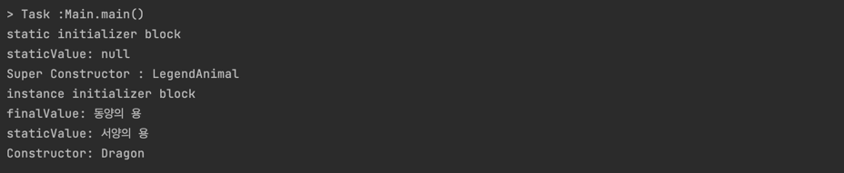

## 💡final 은 총 3가지에 적용될 수 있다 → 변수, 메서드, 클래스


## final 변수

### 원시 타입 (Primitive Type)

```java
public class FinalTest {
  @Test
  public void primitive_test() {
    // 한 번 초기화 되면 변경할 수 없는 상수값이 된다
    final int x = 3;
  }
}
```

### 객체 타입 (Reference Type)

```java
  @Test
  public void reference_test() {
    // 객체 변수의 경우 다른 참조값으로 변경할 수 없게 된다
    final Dragon dragon = new Dragon();
    // 하지만 내부 필드값은 수정할 수 있다
    dragon.setSize(12);
  }
```

### ⭐️클래스 필드⭐️

클래스 멤버 변수를 `final` 로 선언하면 값을 반드시 할당받게 됩니다. 할당받는 방법은 다음 3가지 입니다.

- **선언과 동시에 초기화 할 때 (final int member = 3)**
- **인스턴스 초기화 블록 (instance initializer block)**
- **생성자**

이 때, `static` 이 붙게 된다면 초기화 시점이 다음과 같이 달라지게 된다.

- **선언과 동시에 초기화 할 때 (static final int member = 3)**
- **정적 초기화 블록 (static initializer block)**

추가적으로 `final static` 이 붙게 되면 JVM Method Area(Static Area) 에 **Runtime Constant Pool** 에 등록되기 때문에 class 가 로드되지 않아도 호출이 가능하다

- **클래스 로드 시점**

  JVM 에서 클래스 로더는 컴파일 된 자바 파일(.class)을 동적으로 로드하고 JVM 메모리 영역인 Runtime Data Area 에 배치하는 일을 한다

  **핵심은 JVM 은 실행할 때 모든 클래스를 메모리에 올리는 것이 아닌 필요한 순간에 메모리에 올려 사용한다는 것이다**

  그리고 이러한 순간이란 다음과 같다

    - **static 변수 할당 또는 사용시**
    - **static 메서드 호출 시**
    - **인스턴스 생성 시**
    - **내부 클래스 호출 시**

```java
package com.example.practicejava.test;

public class Dragon {
  final String finalValue;
  static String staticValue;

  // 인스턴스 초기화 블록
  {
    System.out.println("instance initializer block");
    finalValue = "동양의 용";
    System.out.println("finalValue: " + finalValue);
    System.out.println("staticValue: " + staticValue);
  }

  // static 초기화 블록
  static {
    System.out.println("static initializer block");
    System.out.println("staticValue: " + staticValue);
  }

  // 생성자
  public Dragon() {
    System.out.println("Constructor: Dragon");
  }

  // 정적인 메서드
  public static void callStaticMethod() {
    System.out.println("정적인 메서드 호출");
  }

}
```

```java
package com.example.practicejava.test;

public class Main {
  public static void main(String[] args) {
    // 정적인 변수 사용하므로 클래스가 로드됨
    // 클래스 로드 시점에 정적 초기화 블록 실행됨
    Dragon.staticValue = "서양의 용";

    // 부모 생성자 -> 인스턴스 초기화 블록 -> 생성자
    Dragon dragon = new Dragon();
  }
}
```



위와 같이 출력되는 것으로 보아 **클래스가 로드될 때 static 변수들에 대한 초기화가 이루어진다.**

이후 생성자를 호출하였는데 순서는 **부모 생성자 호출 → 인스턴스 초기화 블록 → 자식 생성자** 호출 순으로 이루어진다

### 메서드 인자

**원시 타입, 참조 타입인데 단지 매개변수라고 생각하면 된다**

```java
public void changeSize(final int size) {
    size = 12;
  }
```

## final 메서드

메서드를 final 로 선언하면 상속받은 클래스에서 해당 메서드를 오버라이드 할 수 없게 된다

```java
public class LegendAnimal {
  public final void makeSound() {
    System.out.println("...");
  }

  public LegendAnimal() {
    System.out.println("Super Constructor : LegendAnimal");
  }
}

public class Dragon extends LegendAnimal {
  @Override
  public void makeSound() {
    // 상속이 불가능하다 
  }
}
```

## final 클래스

클래스를 final 로 선언하면 상속 자체가 되지 않는다. **대표적인 클래스는 String**

```java
// 상속 안됨
final class LegendAnimal {

}
```